# cc-Agent-teams-sandbox

<div align="center">
  
</div>

Claude Codeの**Agent Teams機能**のサンドボックスリポジトリ（GLM-4.7対応）

## 概要

このリポジトリは、[Claude CodeのAgent Teams機能](https://code.claude.com/docs/en/agent-teams)を試すためのサンドボックスです。テーマに沿ったエージェントチームを結成し、協調してタスクを達成する様子を観察・実験します。

## 特徴

- 🐱 **テーマ別エージェントチーム**: 桃太郎、魔王軍団、猫のシステム会社など、様々なテーマでチームを結成
- 🤖 **自動リリースシステム**: GitHub Actionsで猫テーマのヘッダー画像付きリリースノートを自動生成
- 🎨 **カスタムSVGヘッダー**: `.github/scripts/generate-header.py` でアニメーション付きのヘッダー画像を生成

## 自動リリースシステム

リリースを作成すると、自動的に以下の処理が実行されます：

1. 猫テーマのSVGヘッダー画像生成
2. Gitコミット履歴からチェンジログ作成
3. リリースノートの自動更新

### 生成されるヘッダー画像

- 浮遊する猫の顔（アニメーション付き）
- 揺れるしっぽ
- キラキラ光るスター
- 猫の肉球パターン背景
- バージョンバッジ

## エージェントチームの例

### Nyan Corporation 🐱

猫の運営するシステム会社をテーマにしたエージェントチーム。

| メンバー | 役割 |
|----------|------|
| Boss Cat | 代表取締役猫・チーム統括 |
| Repository Cat | リポジトリ整備担当 |
| Release Cat | リリース担当 |
| QA Cat | テスト・検証担当 |

## リリース

- [v0.1.0](https://github.com/Sunwood-AI-OSS-Hub/cc-Agent-teams-sandbox/releases/tag/v0.1.0) - Initial Release

## ライセンス

MIT

---

## セットアップ

### 1. リポジトリのクローン

```bash
git clone https://github.com/Sunwood-AI-OSS-Hub/cc-Agent-teams-sandbox.git
cd cc-Agent-teams-sandbox
```

### 2. Z.AI API の設定（GLM-4.7 で動かす場合）

`.zshrc` に以下の設定を追加します：

```bash
# Z.AI API for Claude Code
export ANTHROPIC_BASE_URL="https://api.z.ai/api/anthropic"
export ANTHROPIC_AUTH_TOKEN="your_auth_token_here"
export ANTHROPIC_DEFAULT_HAIKU_MODEL="glm-4.5-air"
export ANTHROPIC_DEFAULT_SONNET_MODEL="glm-4.7"
export ANTHROPIC_DEFAULT_OPUS_MODEL="glm-4.7"
export ANTHROPIC_API_KEY=""

# optional, but recommended by Z.AI docs
export API_TIMEOUT_MS="3000000"
```

設定後、反映させるには：

```bash
source ~/.zshrc
```

### 3. Claude Codeの設定

`.claude/settings.json` でAgent Teamsを有効にします：

```json
{
  "agentTeams": true
}
```

### 4. チーム情報の保存場所

エージェントチームの設定は以下の場所に保存されます：

```bash
# チーム設定ディレクトリ
~/.claude/teams/

# チーム設定ファイル（例：nyan-corp）
~/.claude/teams/nyan-corp/config.json

# タスクリスト
~/.claude/tasks/nyan-corp/
```

### 5. チームの確認

作成されたチームは以下で確認できます：

```bash
# チーム一覧
ls ~/.claude/teams/

# チーム設定の確認
cat ~/.claude/teams/nyan-corp/config.json | jq .
```

## 参考ドキュメント

- [Claude Code Agent Teams Documentation](https://code.claude.com/docs/en/agent-teams)
- [GitHub: cc-Agent-teams-sandbox](https://github.com/Sunwood-AI-OSS-Hub/cc-Agent-teams-sandbox)

---

## エージェントチーム作成プロンプト例

このリポジトリで試したエージェントチーム作成のプロンプト例です。

### おみくじアプリチーム

```
エージェントチームを作ってください。
目的：おみくじアプリの作成。example フォルダにリポジトリを作成し実装する。
役割：
- UX担当
- 技術アーキテクト担当
- 悪魔の代弁者（反証・リスク洗い出し）
```

### 桃太郎チーム

```
桃太郎をテーマにしたエージェントチームを作ってください。
目的：桃太郎が鬼を退治するのに役にたつアプリの作成。example フォルダにリポジトリを作成し実装する。
各エージェントの役割は適宜必要なエージェントを作成してね
```

### 魔王軍団チーム

```
魔王軍団をテーマにしたエージェントチームを作ってください。
目的：魔王軍団がClaudeCodeのエージェントチームを管理するダッシュボードアプリの作成。example フォルダにリポジトリを作成し実装してデプロイする。
READMEも最高峰のクオリティにして
想定では /home/maki/.claude/teams をリアルタイムに関して表示するような感じになると思う

各エージェントの役割は適宜必要なエージェントを作成してね
```

### Nyan Corporation（猫のシステム会社）✅

```
猫の運営するシステム会社をテーマにしたエージェントチームを作ってください。
目的：
リポジトリを整備してリリースすること
example フォルダは追跡から外して

各チームメンバーの役割は適宜必要なチームメンバーを作成してね
```

**結果**: v0.1.0 リリース完了！自動リリースシステム構築済み
